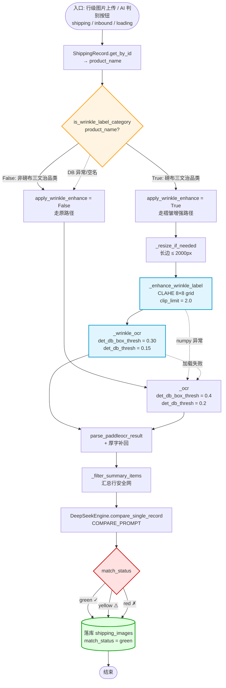

# 优化后的 OCR 识别流程图

## 主流程(行级图片上传 / AI 判别)

```
   ┌──────────────────────────────────────────────────────────┐
   │  入口:行级图片上传 或 AI 判别按钮                          │
   │  (shipping.py / inbound.py / loading.py 三个蓝图)        │
   └────────────────────────┬─────────────────────────────────┘
                            │ image_bytes + record_pk
                            ▼
              ┌─────────────────────────────┐
              │  ShippingRecord.get_by_id() │
              │  → product_name             │
              └──────────────┬──────────────┘
                             │
                             ▼
              ╔═════════════════════════════╗
              ║  is_wrinkle_label_category  ║
              ║       (product_name)?       ║
              ╚══════════════╤══════════════╝
                             │
                ┌────────────┴────────────┐
                │ False                   │ True
                ▼                         ▼
   ┌────────────────────────┐  ┌────────────────────────┐
   │  原路径                 │  │  褶皱增强路径            │
   │  apply_wrinkle_enhance │  │  apply_wrinkle_enhance │
   │  = False               │  │  = True                │
   └───────────┬────────────┘  └────────────┬───────────┘
               │                            │
               │                            ▼
               │               ┌──────────────────────────┐
               │               │  _resize_if_needed()     │
               │               │  (长边 ≤ 2000px)         │
               │               └─────────────┬────────────┘
               │                             │
               │                             ▼
               │               ┌──────────────────────────┐
               │               │  _enhance_wrinkle_label() │
               │               │  ┌──────────────────────┐ │
               │               │  │ 灰度化 L = 0.3R+0.6G+0.1B│ │
               │               │  │ 8×8 网格切分           │ │
               │               │  │ 直方图 clip_limit=2.0 │ │
               │               │  │ 双线性插值边界         │ │
               │               │  │ 三通道同步增强         │ │
               │               │  └──────────────────────┘ │
               │               └─────────────┬────────────┘
               │                             │
               └──────────────┬──────────────┘
                              ▼
               ┌──────────────────────────────┐
               │  PaddleOCREngine._ocr.ocr()  │
               │                              │
               │  原图路径  → _ocr            │
               │    det_db_box_thresh = 0.4   │
               │                              │
               │  褶皱路径  → _wrinkle_ocr    │
               │    det_db_box_thresh = 0.30  │
               │    det_db_thresh    = 0.15   │
               └──────────────┬───────────────┘
                              │ text + bbox
                              ▼
               ┌──────────────────────────────┐
               │  parse_paddleocr_result()    │
               │  → items[] (含 post-proc     │
               │     「厚」字补回)             │
               └──────────────┬───────────────┘
                              │
                              ▼
               ┌──────────────────────────────┐
               │  _filter_summary_items()     │
               │  (汇总行安全网,过滤误识别)    │
               └──────────────┬───────────────┘
                              │ items[]
                              ▼
               ┌──────────────────────────────┐
               │  DeepSeekEngine              │
               │  .compare_single_record()    │
               │  → COMPARE_PROMPT           │
               │  → match_status              │
               │    (green/yellow/red)        │
               └──────────────┬───────────────┘
                              │
                              ▼
               ┌──────────────────────────────┐
               │  落库 shipping_images        │
               │  match_status / score /      │
               │  reason / match_source       │
               └──────────────────────────────┘
```

## 防御性回退(任何异常都不阻塞)

```
   ┌──────────────────────────────────────────────────────────┐
   │  异常点              │  处理                            │
   │  ────────────────────┼───────────────────────────────   │
   │  类别查询 DB 异常    │ → apply_wrinkle = False         │
   │  product_name 空     │ → apply_wrinkle = False         │
   │  CLAHE numpy 异常    │ → return 原图,继续走 _ocr       │
   │  _wrinkle_ocr 加载   │ → 用回 _ocr 实例                 │
   │                      │                                  │
   │  全部「失败即降级」到原路径,不抛异常到调用方                 │
   └──────────────────────────────────────────────────────────┘
```

## 关键差异点(优化前 vs 优化后)

```
   ┌──────────────────┬──────────────────┬──────────────────┐
   │                  │   优化前         │   优化后         │
   ├──────────────────┼──────────────────┼──────────────────┤
   │  入口            │ 同               │ 同               │
   │  类别门控        │ 无               │ 新增             │
   │  预处理          │ 无               │ CLAHE(褶皱路径)  │
   │  PaddleOCR 模型  │ 单实例           │ 双实例,按门控选  │
   │  检测阈值        │ 固定 0.4         │ 0.4 vs 0.30      │
   │  DeepSeek 比对   │ 同               │ 同               │
   │  落库            │ 同               │ 同               │
   │  延迟增量        │ 0               │ +30-80ms         │
   │  新依赖          │ 0               │ 0(numpy + Pillow │
   │                  │                  │  已有)           │
   └──────────────────┴──────────────────┴──────────────────┘
```

---

## Mermaid 源码(可贴入支持工具渲染)

